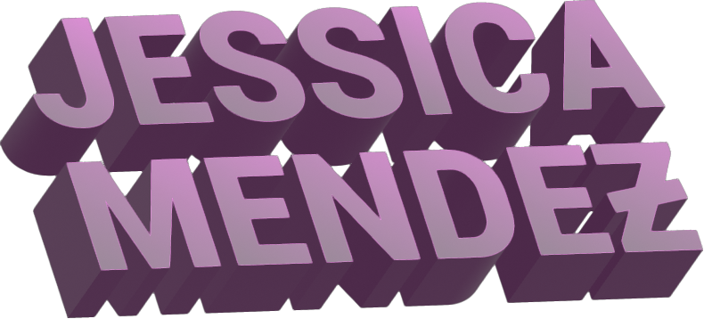

<strong>

<h1>Buenas! 👋🏼 </h1>
</strong>

 

I'm Jessica, a full-stack web developer & product operations wiz based in Long Island, NY. 👩🏼‍💻🌐 

 
 
 

 <h3>🔗 Connect with me</h3>

💻 [/linkedIn](https://www.linkedin.com/in/jessicamendez328/) |
🐙 [/github](https://github.com/siguejessy) |
🧗🏻‍♀️[/CodeSandbox](https://codesandbox.io/u/siguejessy) |
🤳🏼[/instagram](https://www.instagram.com/volcanjessy/)

<h3> ⏱️ Currently, I'm...</h3>

🔍 actively seeking my next professional role

🌱 brushing up on my skills using Figma, Notion, JavaScript, and MongoDB

⌨️ coding a MERN e-commerce site using React & Tailwind CSS

📚 reading articles on [Medium](https://medium.com/) & [DEV.to](https://dev.to/)

🚴🏼‍♀️🏋🏼‍♀️ staying in the best shape of my life

 

